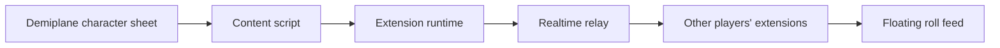

# Architecture

## Visao geral

O projeto tem dois componentes principais:

- `extension`: extensao de navegador instalada pelos jogadores.
- `server`: relay realtime que recebe eventos de rolagem e retransmite para quem esta no mesmo canal.



## Extensao

A extensao roda apenas em paginas do Demiplane compatíveis com fichas:

```text
https://app.demiplane.com/nexus/*/character-sheet/*
```

Responsabilidades:

- Observar a area de rolagem do Demiplane com `MutationObserver`.
- Extrair resultado, nome da rolagem, sucessos e detalhes dos dados quando possivel.
- Evitar duplicatas usando uma assinatura local da rolagem.
- Enviar eventos para o relay quando conectado.
- Mostrar eventos recebidos em um painel flutuante.

## Relay

Responsabilidades:

- Aceitar conexoes WebSocket.
- Agrupar jogadores por canal.
- Validar que a mensagem tem formato esperado.
- Retransmitir eventos apenas para conexoes do mesmo canal.
- Nao armazenar historico sensivel por padrao.

## Canal e senha

O canal identifica a sala da mesa. A senha pode ser usada de duas formas:

- MVP simples: servidor recebe canal e senha, calcula um hash de sala e usa isso para agrupar conexoes.
- Versao mais privada: a senha gera uma chave local; a extensao criptografa o payload antes de enviar, e o relay apenas retransmite bytes.

Para o MVP, a prioridade e validar a experiencia. Para uma versao usada com mais frequencia, criptografia local e melhor.

## Formato do evento

```json
{
  "type": "roll",
  "version": 1,
  "roomId": "hash-do-canal",
  "clientId": "uuid-local",
  "playerName": "Edmund",
  "characterName": "Edmund Shelby",
  "source": "demiplane",
  "system": "vampire",
  "rollTitle": "Strength + Athletics",
  "successes": 2,
  "dice": [
    { "kind": "regular", "value": 8 },
    { "kind": "regular", "value": 5 },
    { "kind": "hunger", "value": 10 }
  ],
  "rawText": "STRENGTH + ATHLETICS\\nSUCCESSES: 2\\nDETAILS ...",
  "createdAt": "2026-05-12T00:00:00.000Z"
}
```

## Captura no Demiplane

Pesquisa inicial encontrou estes pontos uteis:

- A pagina e um app Next.js.
- O bundle referencia estado de rolagem `system--dice-state`.
- O componente de rolagem usa classes como `.dice-roller`, `.dice-history-main-container`, `.dice-history-successes-container`, `.dice-history-successes-value`.
- Existem eventos internos ligados a rolagens, como `ROLL`, `REROLL`, `STATE_UPDATED` e `VALUES_CLEARED`.

Para o MVP, a abordagem menos invasiva e observar o DOM renderizado. Se isso ficar fragil, podemos estudar uma injecao mais profunda no runtime do app, mas isso deve ser a segunda opcao.

## Stack inicial sugerida

- Extensao: TypeScript, Manifest V3, Vite.
- Relay local: Node.js, TypeScript, `ws`.
- Validacao: `zod`.
- Teste manual: Chrome/Edge em modo developer.

## Criterio de sucesso do MVP

Duas janelas de navegador conectadas ao mesmo canal devem compartilhar uma rolagem feita no Demiplane em menos de 1 segundo, sem interacao extra alem da rolagem normal.
